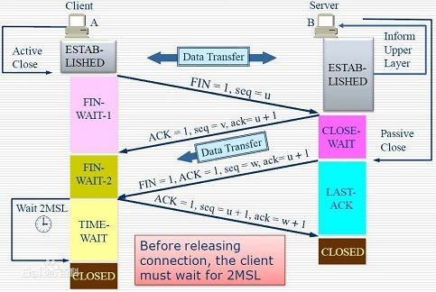

1. TCP/IP四层协议系统
    - 应用层 HTTP PING TELNET DNS
    - 传输层 TCP UDP
    - 网络层 IP ICMP(Internet Control Message Protocol)(主要用于检测网络连接)
    - 数据链路层 ARP(Address Resolve Protocol)
2. 为什么TCP是面向数据流的，而UDP是面向数据报的？
    - 通过TCP连接给另一端发送数据，你只调用了一次write， 发送了100个字节，但是对方可以分10次收完，每次10个字节；你也可以调用10次write，每次10个字节，但是对方可以一次就收完。（假设数据都 能到达）但是，你发送的数据量不能大于对方的接收缓存（流量控制），如果你硬是要发送过量数据，则对方的缓存满了就会把多出的数据丢弃。
    - UDP 和TCP不同，发送端调用了几次write，接收端必须用相同次数的read读完。UPD是基于报文的，在接收的时候，每次最多只能读取一个报文，报文和 报文是不会合并的，如果缓冲区小于报文长度，则多出的部分会被丢弃。也就说，如果不指定MSG_PEEK标志，每次读取操作将消耗一个报文。
    - 其实，这种不同是由TCP和UDP的特性决定的。TCP是面向连接的，也就是说，在连接持续的过程中，socket中收到的数据都是由同一台主机发出的（劫持什么的不考虑），因此，知道保证数据是有序的到达就行了，至于每次读取多少数据自己看着办。而 UDP是无连接的协议，也就是说，只要知道接收端的IP和端口，且网络是可达的，任何主机都可以向接收端发送数据。这时候，如果一次能读取超过一个报文的 数据，则会乱套。比如，主机A向发送了报文P1，主机B发送了报文P2，如果能够读取超过一个报文的数据，那么就会将P1和P2的数据合并在了一起，这样 的数据是没有意义的。
    - 发送端执行的写操作次数和接收端执行的读操作次数之间没有任何的数量关系，这就是字节流的概念：应用程序对数据的发送和接受是没有边界限制的。UDP发送端应用程序没执行一次写操作，UDP模块就将其封装成一个UDP数据报并发送之。接收端必须及时针对每一个UDP数据报执行读操作（通过recvfrom系统调用），否则就会丢包。并且，如果用户没有指定足够的应用程序缓冲区来读取UDP数据，则UDP数据将被截断。    
3. 端口号 16位（65536）
    - DNS端口号 53
    - HTTP端口号 80
4. ARP协议：从IP地址到以太网地址（MAC地址）的转换。
    - 工作原理：主机向自己所在的网络广播一个ARP请求，该请求包含目标机器的网络地址。此网络上的其他机器都将收到这个请求，但只有被请求的目标机器会回应一个ARP应答，其中包含自己的物理地址。
    - ARP维护一个高速缓存，其中包含经常访问（比如网关地址）或最近访问的机器的IP地址到物理地址的映射。这样就避免了重复的ARP请求，提高了发送数据包的速度。
5. socket和TCP/IP协议族的关系
    - 数据链路层、网络层、传输层协议是在内核中实现的。因此操作系统需要实现一组系统调用，使得应用程序能够访问这些协议提供的服务。实现这组系统调用的API就是socket。
    - socket API的功能：
        - 将应用程序数据从用户缓冲区中复制到TCP/UDP内核发送缓冲区，以交付内核来发送数据（如send函数），或者是从内核TCP/UDP接收缓冲区中复制数据到用户缓冲区，以读取数据。
        - 应用程序可以通过它们来修改内核中各层协议的某些头部信息或其他数据结构，从而精细地控制底层通信地行为。比如可以通过setsockopt函数来设置IP数据报在网络上的存活时间。
6. IP协议
    - 特点
        - 无状态
        - 无连接
        - 不可靠
    - IP分片：当IP数据报的长度超过帧的MTU（以太网帧的MTU 1500字节），它将被分片传输。分片可能发生在发送端，也可能发生在中转路由器上，而且可能在传输的过程中被多次分片，但只有在最终的目标机器上，这些分片才会被内核中的IP模块重新组装。
    - IP路由
        - IP模块工作流程
        - 路由机制
        - 路由表更新
    - IP转发
7. TCP协议
    - TCP头部结构
        - 16位源端口号/目的端口号
        - 32位序号(sequence number): 一次TCP通信（从TCP连接到断开）过程中某一个传输方向上的字节流的每个字节的编号。序号值被初始化为某个随机值ISN(Initial Sequence Number)
        - 32位确认号(acknowledgement number): 用作对另一方发来的TCP报文段的响应，其值是收到的TCP报文段的序号值加1。
        - 4位头部长度：标识该TCP头部有多少个32bit字
        - 6位标志位
            - URG 表示紧急指针是否有效
            - ACK 表示确认号是否有效。携带ACK标志的TCP报文段为确认报文段。
            - PSH 提示接收端应用程序应该立即从TCP接收缓冲区中读走数据，为接收后续数据腾出空间。
            - RST 表示要求对方重新建立连接。携带RST标志的TCP报文段为复位报文段。
            - SYN 表示请求建立一个连接。携带SYN标志的TCP报文段为同步报文段。
            - FIN 表示通知对方本端要关闭连接了。携带FIN标志的TCP报文段为结束报文段。
        - 16位窗口大小：接受通告窗口(RWND)。它告诉对方本端的TCP接收缓冲区还能容纳多少字节的数据，这样对方就可以控制发送数据的速度。
        - 16位校验和
        - 16位紧急指针
        - options
    - 半关闭状态：通信的一端可以发送结束报文段给对方，告诉它本端已经完成了数据的发送，但允许继续接受来自对方的数据，直到对方也发送结束报文段以关闭连接。
    
    - TCP状态转移
        - 三次握手
        - 四次挥手
        - TIME_WAIT状态
            - 客户端连接在收到服务器的结束报文段之后，并没有直接进入CLOSED状态，而是转移到TIME_WAIT状态。在这个状态，客户端连接要等待一段长为2MSL（Maximum Segment Life，报文段最大生存时间）的时间，才能完全关闭。
            - TIME_WAIT存在的原因：
                - 假设最后的ACK丢失，server将重发FIN，client必须维护TCP状态信息以便可以重发最后的ACK，否则将会发送RST，结果server认为发生错误。TCP实现必须可靠地终止连接的两个方向，所以client必须进入TIME_WAIT状态。
                - 此外，考虑一种情况，TCP实现可能面临着先后两个相同的五元组。如果前一个连接处于TIME_WAIT状态，而允许另一个拥有相同五元组连接出现，可能处理TCP报文时，两个连接互相干扰。所以使用SO_REUSEADDR选项就需要考虑这种情况。
    - 长连接 && 短链接
        - 长连接可以省去较多的tcp建立/关闭的操作，减少浪费，节省时间，对于频繁请求资源的客户，较适用于长连接；client和server如果长时间不关闭的话，会存在一个问题，随着客户的越来越多，server早晚会有扛不住的一天，这时需要采取一些策略，如关闭一些长时间不读写操作的连接，这样可以避免一些恶意连接导致server端服务受损，如果条件再允许，就可以以客户端为颗粒度，限制每个客户端的最大连接数。
        - 短连接对于服务器来说较为简单，存在的连接都是有用的连接，不需要额外的控制，但如果客户端连接频繁，会在tcp的建立和关闭上浪费时间。
    - TCP如何保证可靠性传输
        - 连接管理（三次握手/四次挥手）
        - 校验和
        - 序号和确认序号
        - 超时重传
        - 定时器
        - **流量控制**
        - **拥塞控制**
    - TCP拥塞控制算法
        - 慢启动：指数扩大cwnd
        - 拥塞避免：拥塞出现后线性增加cwnd，设置ssthresh = cown/2
        - 快重传：收到三次冗余ACK后立即重传，不等定时器到时
        - 快恢复：当发送方连续收到三个重复确认，就执行“乘法减小”算法，把慢启动门限ssthresh减半，然后开始执行拥塞避免算法
    - Nagle算法：若发送应用进程把要发送的数据逐个字节地送到TCP的发送缓存，则发送方就把第一个数据字节先发送出去，把后面到达的数据字节都缓存起来。当发送方接收对第一个数据字符的确认后，再把发送缓存中的所有数据组装成一个报文段再发送出去，同时继续对随后到达的数据进行缓存。只有在收到对前一个报文段的确认后才继续发送下一个报文段。当数据到达较快而网络速率较慢时，用这样的方法可明显地减少所用的网络带宽。Nagle算法还规定：当到达的数据已达到发送窗口大小的一半或已达到报文段的最大长度时，就立即发送一个报文段。
    - TCP粘包/拆包